---

title: Caffeine Cache란 무엇이고 왜 빠르게 동작하는가?
date: 2024-09-21
categories: [SUWIKI]
tags: [SUWIKI]
layout: post
toc: true
math: true
mermaid: true

---

# 참고자료

[CaffeineCache-1](https://www.sobyte.net/post/2022-04/caffeine/)

[CaffeineCache-2](https://medium.com/naverfinancial/%EB%8B%88%EB%93%A4%EC%9D%B4-caffeine-%EB%A7%9B%EC%9D%84-%EC%95%8C%EC%95%84-f02f868a6192)

[eTag](https://yozm.wishket.com/magazine/detail/1772/)

---

# Caffeine Cache를 활용하여 홈 API 응답시간 개선

## 왜 홈 API에 캐시를 적용했는가?

사용자들의 빈번한 CS로 홈 화면의 로딩이 느리게 된다는 점을 제보받았다.

클라이언트와 서버 측 모두 개선할 여지가 있는 부분이기 때문에 이를 개선해보고자 했다.

---

# 캐싱된 데이터가 가장 최신의 데이터라는 것을 판별할 수 있는 방법은?

서버에서 캐시가 업데이트될 때마다 캐시의 버전을 업데이트하고 클라이언트는 요청할 때 버전을 함께 전달하도록 한다.

서버는 현재 버전과 클라이언트가 전달한 버전을 비교하여 최신인지 확인하여 데이터의 최신화 여부를 판별하면 될 것 같다.

---

# 왜 로컬 캐시 중 Caffeine Cache를 적용했는지?

- 캐시 전략에 우선순위를 부여 가능하다.
- 캐시 히트율이 매우 높은 알고리즘인 `Window TinyLFU`를 제공한다.

---

# Caffeine 캐싱 데이터 저장 방식

- JVM Heap 메모리 내에 저장된다.

---

# Caffeine 캐싱 전략

```mermaid
%%{init: { 'theme':'dark' }}%%
graph TD
    subgraph CaffeineStructure["Caffeine Cache 구조"]
        NewData[새로운 데이터] --> WindowCache[Window Cache<br/>전체 크기의 1%]
        WindowCache -- "LRU 방출" --> WE[방출된 데이터]
        WE -- "TinyLFU<br/>진입 정책" --> ProbationCache[Probation Cache<br/>Main Cache의 20%]
        ProbationCache -- "자주 접근됨" --> ProtectedCache[Protected Cache<br/>Main Cache의 80%]
        ProtectedCache -- "LRU 방출" --> PE[방출된 데이터]
        PE -- "TinyLFU<br/>진입 정책" --> ProbationCache
    end

    classDef cacheBox fill:#2a4858,stroke:#68c1e8,stroke-width:2px
    class WindowCache,ProbationCache,ProtectedCache cacheBox
```



## Window Cache (1%)

- 모든 신규 데이터의 첫 진입점
- 버스트 트래픽으로부터 Main Cache 보호
- LRU 정책으로 공간 확보
- 방출 데이터는 TinyLFU 정책으로 Probation으로 이동 시도

## Main Cache (99%)

### Probation Cache (20%)

- 새로운 데이터의 유용성 검증 공간
- TinyLFU 정책으로 데이터 관리
- 자주 접근되는 데이터는 Protected로 승격

### Protected Cache (80%)

- 자주 사용되는 데이터 보관
- LRU 정책으로 공간 확보
- 방출 데이터는 TinyLFU로 Probation 이동 시도

## TinyLFU 정책

```mermaid
%%{init: { 'theme':'dark' }}%%
graph TD
    subgraph TinyLFUFlow["TinyLFU 진입 정책"]
        Start[진입 요청] --> CompareFreq{접근 빈도<br/>비교}
        CompareFreq -->|"Candidate > Victim"| Accept[Candidate 승인<br/>Victim 제거]
        CompareFreq -->|"Candidate < Victim"| Reject[Candidate 거부<br/>Victim 유지]
        CompareFreq -->|"Candidate = Victim"| RejectEqual[Candidate 거부<br/>기존 데이터 보호]
        Start --> CheckFreq{접근 횟수<br/>확인}
        CheckFreq -->|"5회 미만"| RejectLow[Candidate 거부<br/>캐시 오염 방지]
    end

    classDef flowBox fill:#2d2b55,stroke:#a277ff,stroke-width:2px
    class Start,CompareFreq,Accept,Reject,RejectEqual,CheckFreq,RejectLow flowBox
```



## 용어 정리

```mermaid
%%{init: { 'theme':'dark', 'themeVariables': { 'fontSize': '20px' } }}%%
graph TD
   subgraph Terms["주요 용어"]
       T1["`**Candidate**
       Window/Protected Cache에서
       Probation Cache로 진입을 시도하는 데이터`"]
       T2["`**Victim**
       Probation Cache 내에서
       제거 대상이 될 수 있는 데이터`"]
       T3["`**Window Cache**
       버스트 트래픽으로부터
       캐시 오염을 방지하는 첫 번째 방어선`"]
       T4["`**Probation Cache**
       데이터의 유용성을 검증하는 공간`"]
       T5["`**Protected Cache**
       자주 사용되는 데이터를 보관하는 공간`"]
   end

   classDef termBox fill:#1e3339,stroke:#61efce,stroke-width:2px,font-size:18px
   class T1,T2,T3,T4,T5 termBox
```



- Candidate: Window/Protected Cache에서 Probation으로 이동 시도하는 데이터
- Victim: Probation Cache에서 제거 대상 데이터

### 판단 규칙

- Candidate 접근 횟수 > Victim 접근 횟수
  - Victim 제거, Candidate 진입

- Candidate 접근 횟수 < Victim 접근 횟수
  - Candidate 제거, Victim 유지

- Candidate 접근 횟수 = Victim 접근 횟수
  - Candidate 제거 (기존 데이터 보호)

- Candidate 접근 횟수 < 5
  - Candidate 제거 (캐시 오염 방지)

- 적용 시점
  - Window Cache 방출 데이터의 Probation 진입 시
  - Protected Cache 방출 데이터의 Probation 진입 시

---

## 실제 코드로 적용해보기

```java
@Configuration
public class CacheConfig {

    @Bean
    public CacheManager cacheManager() {
        SimpleCacheManager cacheManager = new SimpleCacheManager();
        List<CaffeineCache> caches = Arrays.stream(CacheType.values())
            .map(cache -> new CaffeineCache(cache.getCacheName(), Caffeine.newBuilder().recordStats()
                    .expireAfterWrite(cache.getExpiredAfterWrite(), TimeUnit.SECONDS)
                    .maximumSize(cache.getMaximumSize())
                    .build()
                )
            )
            .collect(Collectors.toList());
        cacheManager.setCaches(caches);
        return cacheManager;
    }
}
```

위와 같은 CacheManager를 Bean으로 등록해줬다.

또한 어떤 데이터를 캐싱할지를 정의하기 위해 아래 CacheType을 정의했다.

```java
@Getter
public enum CacheType {
    LECTURE("lecture", 10 * 60, 1000);

    CacheType(String cacheName, int expiredAfterWrite, int maximumSize) {
        this.cacheName = cacheName;
        this.expiredAfterWrite = expiredAfterWrite;
        this.maximumSize = maximumSize;
    }

    private final String cacheName;
    private final Integer expiredAfterWrite;
    private final Integer maximumSize;
}
```

위 두 가지 요소들로 캐시를 사용하기 위한 설정을 해줬다면 실제 컨트롤러 부분에서 캐시를 적용시켜야한다.

```java
    @Cacheable(cacheNames = "lecture") // Cache 적용
    @CacheStatics // 캐시 Miss/Hit 통계를 위한 Aspect 애노테이션
    @ApiLogger(option = "lecture")
    @GetMapping("/all")
    public ResponseEntity<LectureAndCountResponseForm> findAllLectureApi(
        @RequestParam(required = false) String option,
        @RequestParam(required = false) Integer page,
        @RequestParam(required = false) String majorType
    ) {

        LectureFindOption findOption = new LectureFindOption(option, page, majorType);
        LectureAndCountResponseForm response = lectureService.readAllLecture(findOption);
        return ResponseEntity.ok(response);
    }
```

---

## Local Cache - Ehcache vs Caffeine 성능 비교

[벤치마크 결과](https://github.com/ben-manes/caffeine/wiki/Benchmarks)

위 벤치마크 결과를 본다면 압도적으로 카페인 캐시가 성능이 좋게 나온다.

성능이 좋다고 무조건 쓰는게 좋은 것은 아니므로 기존 환경을 잘 고려하여 선택하면 될 것 같다.

---

## 성능 개선 측정은 어떻게 했는지?

포스트맨으로 측정했다. 최근에 JMeter, nGrinder등 성능 측정, 모니터링 툴을 알게되어 이러한 도구들을 쓸 수도 있을 것 같다.

---

## 캐시가 효과가 있는지는 어떻게 아는지?

```java
@Component
@RequiredArgsConstructor
@Slf4j
public class CacheStaticsLogger {

    private final CacheManager cacheManager;

    public void getCachesStats(String cacheKeys) {
        CaffeineCache cache = (CaffeineCache) cacheManager.getCache(cacheKeys);
        CacheStats stats = Objects.requireNonNull(cache).getNativeCache().stats();

        log.info("Cache hit count: " + stats.hitCount());
        log.info("Cache miss count: " + stats.missCount());
    }
}
```

위와 같은 CacheStats 객체를 통해 캐시 히트와 캐시 미스의 대한 지표를 얻을 수 있다.

이 객체를 활용, 로그를 모니터링을 함으로써 캐시가 히트됐을 때의 응답속도를 측정하면 근거가 될 것으로 본다.

---

## 캐시의 TTL은 어떻게 지정할까?

캐시 히트율을 통계로 추출하여 캐시 TTL을 조정해가며 적절한 타협점을 찾는게 좋을 것 같다.

---

## 캐시 TTL을 짧게 가져갔을 때와 길게 가져갔을 때의 장/단점은 어떤게 있을까?

- `TTL을 짧게 가져간다면`
    - 캐싱된 데이터가 가장 최근에 업데이트된 데이터에 빠르게 반영될 수 있는 장점이 있다.
    - 하지만 자주 변하지 않는 데이터라면 캐시를 교체하는 리소스가 빈번하게 발생할 수 있다는 단점이 있다.

- `TTL을 길게 가져간다면`
    - 캐시를 교체하는 주기가 길어지기 때문에 캐싱된 데이터를 변경없이 오랫동안 제공할 수 있는 장점이 있다.
    - 하지만 캐시가 교체되어야할 시점에 적절하게 교체되지 못하여 변경 전의 데이터를 장기간 제공하는 상황이 발생할 수 있다는 단점이 있따.

---

## 해당 캐시가 가장 최신의 데이터임을 판별하는 방법은?

캐시에 `메타데이터`를 넣으면 어떨까?

- 캐시 데이터에 해당 캐시의 버전을 표기할 수 있는 메타데이터를 통해 클라이언트와 버전 싱크를 맞추면 해결할 수 있을 것으로 생각한다.

- 클라이언트는 응답 받은 데이터의 캐시 정보에 대한 메타데이터를 확인하고 이전에 받은 데이터의 버전과 일치한다면 최신 버전으로 간주하고
    - 만약 버전이 변경되었다면 새로운 캐시를 받아 반영하는 방식을 적용한다면 될 것 같다.

### 캐시 신선도를 활용하기 위한 eTag 활용하기

위에서 언급한 방법을 실제 코드로 적용한 바는 아래와 같다.


```java
@Configuration
public class ETagConfig {

    @Bean
    public ShallowEtagHeaderFilter shallowEtagHeaderFilter() {
        FilterRegistrationBean<ShallowEtagHeaderFilter> filterFilterRegistrationBean = new FilterRegistrationBean<>(
            new ShallowEtagHeaderFilter()
        );

        filterFilterRegistrationBean.addUrlPatterns("/lecture/all");
        filterFilterRegistrationBean.setName("etagFilter");
        return new ShallowEtagHeaderFilter();
    }

}
```

위와 같이 ETag를 추가하면, 응답에 `ETag`라는 헤더 네임을 가진 `MD5 Payload`가 생성된다.

이 정보를 바탕으로 클라이언트가 `if-None-Match`라는 이전에 응답 받았던 요청 헤더에 `MD5 Payload`를 넣고 요청하게되면 캐시의 변동사항이 있는지 확인할 수 있게 된다.

이전에 받은 캐시 내용을 그대로 사용해도 된다면 HTTP Status 304을 내리게 되는데 클라이언트는 이 상태 코드를 보고 데이터를 사용하면 된다.
