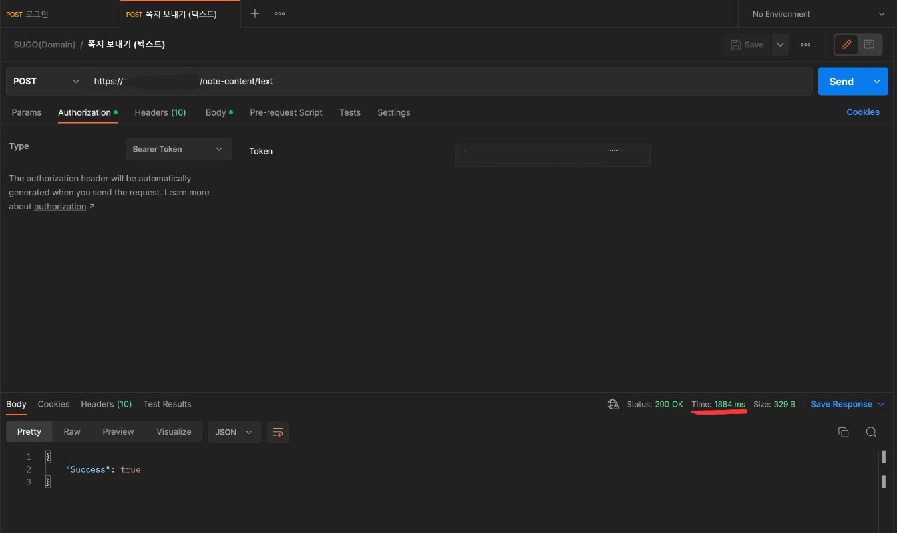
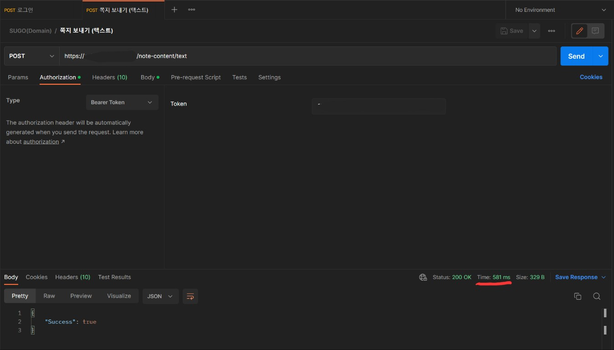
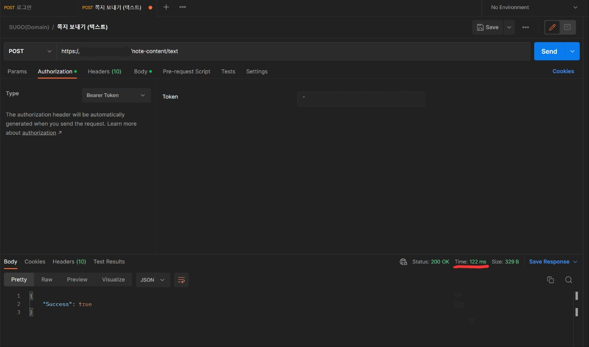

---

title: @Async 애노테이션 조금 더 효율적으로 사용해보기
author: 김도현
date: 2023-02-26
categories: [Spring, Async, Thread]
tags: [Spring, Async, Thread]
math: true
mermaid: true

---

# 문제 상황

클라이언트에 푸쉬 알림을 전송하기 위해 FCM 서버에 요청하는 로직을 @Async 애노테이션을 활용하여

비동기로 처리할 수 있도록 하였다.

그런데, 이 비동기 메서드를 추가하자마자 Postman에서 최종적으로 클라이언트가 받는 요청에 대한 응답시간이 현저하게 늘어났다.




- 서버가 켜진 즉시 첫 요청 시 응답시간 **1884ms**

- 가장 빨랐던 요청 시 응답 시간 **658ms**

비동기 메서드를 추가하기 전에는 100ms도 넘지 않았던 응답시간이 저렇게 급격하게 늘어나니 클라이언트단에서도

응답을 기다리느라 화면에서 버벅이는 듯한 문제점일 발생되었다.

# 어떻게 속도를 빠르게 할 수 있을까?

"Spring boot @Async optimization" 이라고 검색하면 가장 많이 나오는 내용이

**ThreadPoolTaskExecutor**에 관한 내용이 등장한다.

뭔가 해결을 위한 단서가 나온 것 같다!

## ThreadPoolTaskExecutor와 @Async

[Asynchronous calls in spring](https://www.linkedin.com/pulse/asynchronous-calls-spring-boot-using-async-annotation-omar-ismail/)

Spring에서 백그라운드 작업을 처리하려면 그 처리를 담당하는 스레드 풀을 관리해줘야한다.

그리고 스레드 풀을 관리하기 위한 Bean을 등록하기 위해 다음 인터페이스의 구현체를 셋팅해줘야 하는 것이다.

```java
public interface AsyncConfigurer {

	/**
	 * The {@link Executor} instance to be used when processing async
	 * method invocations.
	 */
	@Nullable
	default Executor getAsyncExecutor() {
		return null;
	}

	/**
	 * The {@link AsyncUncaughtExceptionHandler} instance to be used
	 * when an exception is thrown during an asynchronous method execution
	 * with {@code void} return type.
	 */
	@Nullable
	default AsyncUncaughtExceptionHandler getAsyncUncaughtExceptionHandler() {
		return null;
	}

}
```

하지만 꼭 위 인터페이스를 구현체로 등록하지 않아도 되긴하다. 그냥 ThreadPoolTaskExecutor를 반환하는 메서드를 Bean으로 등록해주면 되는 것일 뿐이다.

## @Async 애노테이션이 어떻게 동작하는건가?

- @Async 애노테이션이 붙은 메서드가 실행될 때, 프록시가 해당 호출을 가로채고 Task Executor에 전달한다.

- Task Executor는 새로운 스레드를 생성하고 해당 스레드에서 호출된 로직을 실행한다. 그리고 이 때 이 메서드의 리턴을 기다리지 않고 다른 작업을 계속 수행한다.

- 이전에 호출시킨 메서드가 리턴되었다면 Task Executor에 결과를 반환한다.

간략하지만 그래도 나름 핵심이 있는 과정이다.

위에 작성한 과정들 중 새로운 스레드를 생성한다는 점이 성능 저하의 문제가 될 수 있다.

스레드를 생성하는 비용은 어떤 스레드이던 그리 만만한 작업이 아니기 때문에 시간이 다소 걸리기 때문이다.

또한 비동기 메서드를 실행하는 스레드는 Spring에서 관리하는 스레드 풀에서 가져오는 것이다.

```java
public class ThreadPoolTaskExecutor extends ExecutorConfigurationSupport
		implements AsyncListenableTaskExecutor, SchedulingTaskExecutor {

    private final Object poolSizeMonitor = new Object();

    private int corePoolSize = 1;

    private int maxPoolSize = Integer.MAX_VALUE;

    private int keepAliveSeconds = 60;

    private int queueCapacity = Integer.MAX_VALUE;

    private boolean allowCoreThreadTimeOut = false;

    private boolean prestartAllCoreThreads = false;

    ...
}
```
위 코드가 Spring이 관리하는 스레드 풀인 ThreadPoolTaskExecutor이다.

해당 클래스의 프로퍼티를 보면,

- 초기 Thread Size는 1

- 최대 Thread Pool Size는 약 21억

- Queue 용량은 약 21억

으로 설정되어있다.

위 설정을 그대로 사용해도 좋지만 애플리케이션 환경과 서버의 하드웨어 스펙에 따라 조정해 줄 필요는 있을 것 같다.

---

# 다시 돌아와서, 뭐가 문제였나?

나는 위에서 본 ThreadPoolTaskExecutor와 같이 스레드 풀을 관리해주는 설정을 Bean으로 등록하지 않았다.

그러니까 쓰레드 하나로 비동기 메서드까지 처리하려하니 동기로 실행한 것이랑 다를 바가 없었고 느려질 수 밖에 없었다.

# 해결 방안 및 성능 개선 결과

```java
@Configuration
@EnableAsync
public class AsyncConfig implements AsyncConfigurer {

    @Override
    public Executor getAsyncExecutor() {
        ThreadPoolTaskExecutor executor = new ThreadPoolTaskExecutor();
        executor.setCorePoolSize(3);
        executor.setMaxPoolSize(30);
        executor.setQueueCapacity(90);
        executor.setThreadNamePrefix("SUGO-DIGER-ASYNC-");
        executor.initialize();

        return executor;
    }
}
```

위와 같은 설정을 Bean으로 등록해주면 끝이다! 이렇게 간단하게 해결할 수 있음에도 성능 차이는 엄청났다.






- 서버가 켜진 즉시 첫 요청 시 응답시간 **1884ms** -> **581ms**

- 평상시 응답 시간 **658ms** -> **122ms**

으로 개선되었으며

서버가 켜진 즉시 첫 요청 응답 시간은 약 324%로 빨라졌고

평상시 응답 시간은  539%로 빨라졌다.
