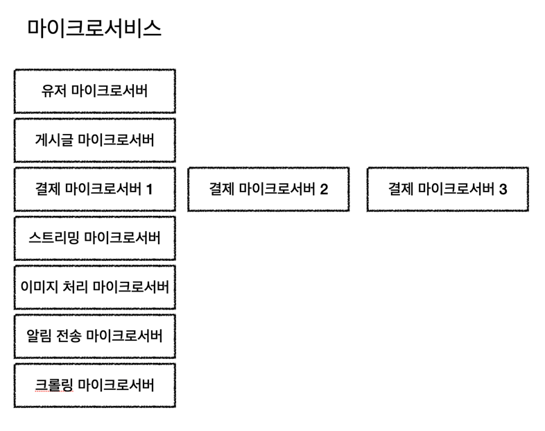

---

title: 커서기반 페이징 및 MySQL 최적화 참고 내용

date: 2023-05-03
categories: [MySQL, Cursor, Paging]
tags: [MySQL, Cursor, Paging]
layout: post
toc: true
math: true
mermaid: true

---

# 흔하디 흔한 오프셋 기반 페이징

offset 쿼리를 사용해서 조회할 데이터를 분할해서 가져온다.

## 문제점 1. 데이터 중복/유실

페이징 중 데이터 추가/삭제 시 중복된 혹은 유실된 데이터 반환

이 내용은 아직 시나리오가 정확히 이해가 가지 않아서 나중에 자세한 시나리오를 작성하기로한다.


## 문제점 2. 성능

일단 Limit, Offest 문법은 다음과 같이 동작한다.

`SELECT * FROM employees LIMIT 0, 10;`

테이블을 풀 스캔하여 10개의 레코드가 되는 순간 쿼리를 멈춘다.

`SELECT * FROM employees GROUP BY first_name LIMIT 0, 10;`

Group By가 처리된 후 Limit을 처리한다. 따라서 일단 싹 다 가져온 후 Limit을 거는거기 때문에 성능이점은 없다.

`SELECT * FROM employees WHERE emp_no BETWEEN 10001 AND 10010 ORDER BY first_name LIMIT 0, 10`

ORDER BY 가 처리된 후 Limit을 처리한다. 이것도 일단 싹 다 가져온 후 Limit을 거는거기 때문에 성능이점은 없다.

> 참고할 점, Offset은 시작 위치를 말하는 것이다.

그럼 Limit을 할 때 offset을 따로 지정하는 `Limit N, M` 과 그렇지 않은 `Limit N`의 차이점은 어떻게 될까?

`SELECT * FROM employee WHERE id > 10000000 ORDER BY id LIMIT 10;`

위 쿼리는 10개를 조회하는 순간 끝이 난다.

`SELECT * FROM employee WHERE id > 10000000 ORDER BY id LIMIT 10000000, 10;`

위 쿼리는 10000000번째의 레코드까지 찾아가서 10개를 조회한 후 끝이난다.

따라서 성능차이는 레코드 수가 많고 offset을 사용하면 급격하게 낮아질 수 있다.

오프셋 기반 페이징이 이래서 문제라는 것이다.

---

# 커서 기반 페이징

기본 개념은 클라이언트가 가져간 레코드를 기준으로 그 다음의 N개의 데이터를 꺼내 주는 것이다.

만약 id가 1000 ~ 0 까지 있는 레코드가 있다고 했을 때 첫 번째 페이지에서

클라이언트가 전달받은 마지막 id가 996이라고 한다면 아래와 같은 쿼리로 다음 페이지를 주면 된다.

```mysql
SELECT id, title
FROM products
WHERE id < 996
ORDER BY id DESC
LIMIT 5
```

이를 QueryDSL로 녹여내면 다음과 같다.

```java
@Override
public Page<Post> findByCustom_cursorPaging(Pageable pageable, String sorting, Long cursorIdx) {
    QPost post = QPost.post;

    List<Post> content = queryFactory
        .select(post)
        .from(post)
        .join(post.user)
        .fetchJoin()
        .orderBy(PostSort(pageable))
        .where(cursorId(sorting,cursorIdx))
        .limit(pageable.getPageSize())
        .fetch();

    return new PageImpl<>(content,pageable,total);
}
```

커서가 거창한 건줄 알았는데 별거 없다. 그냥 정렬 조건을 커서라고 봐도 된다.

---

# 참고하면 좋을 내용

[참고 블로그](https://blog.lael.be/post/370)

## ON DUPLICATE KEY UPDATE

[참고 블로그](https://bamdule.tistory.com/112)

데이터 삽입 시 중복키 제약 조건에 위배되면 ON DUPLICATE KEY UPDATE 구문에 지정한 내용이 실행된다. (즉, 중복된 키 값을 바탕으로 뭔가 삽입을 시도하면 삽입이 아닌 업데이트를 해주는 것)



근데 사실 JPA를 사용할 땐 필요없다. 영속성 컨텍스트와 더티체킹이 있기 때문

## EXPLAIN SELECT

[참고 블로그](http://chongmoa.com/sql/8840)

EXPLAIN SELECT는 쿼리 실행 플랜 (query execution plan) 정보를 옵티마이저 (optimizer)에서 가져 와서 출력 한다.

즉, MySQL은 테이블들이 어떤 순서로 조인 (join) 하는지에 대한 정보를 포함해서, SELECT를 처리하는 방법에 대해서 알려 준다.

## auto_increment

```text
MySQL에서 AUTO_INCREMENT는 테이블의 기본키(primary key) 필드에 대해 자동으로 고유한 값을 생성하는 기능입니다. 이 기능은 매우 일반적으로 사용되는 기능 중 하나이며, 많은 MySQL 데이터베이스 시스템에서 사용되고 있습니다.

AUTO_INCREMENT가 최적화가 잘되어 있는 이유는 다음과 같습니다.

    내부적으로 인메모리에 캐시되어 속도가 빠르다
    MySQL에서는 AUTO_INCREMENT 값을 생성할 때 내부적으로 인메모리 캐시를 사용하여 성능을 향상시킵니다. 이를 통해 매번 디스크에 접근하지 않고도 AUTO_INCREMENT 값을 생성할 수 있으므로, 속도가 빨라집니다.

    Lock을 최소화하여 성능을 향상시킨다
    AUTO_INCREMENT 값은 테이블에 레코드를 삽입할 때마다 새로 생성됩니다. 이때 INSERT 작업을 수행하는 트랜잭션이 AUTO_INCREMENT 값 생성에 대한 락을 획득하고, 새로운 값을 생성합니다. 이때 락을 최소화하여 성능을 향상시키기 위해, MySQL에서는 내부적으로 AUTO_INCREMENT 값을 생성하는 작업에 대해 최소한의 락만 사용합니다.

    Master-Slave Replication 환경에서의 문제점을 최소화한다
    MySQL에서는 Master-Slave Replication 환경에서 AUTO_INCREMENT 값의 충돌 문제가 발생할 수 있습니다. 이를 방지하기 위해, MySQL에서는 AUTO_INCREMENT 값의 생성 방식을 Replication 환경에 맞게 최적화하고 있습니다. 이를 통해 Replication 환경에서 AUTO_INCREMENT 값이 일관되게 생성되도록 보장합니다.

따라서, MySQL에서 AUTO_INCREMENT는 내부적으로 캐시를 사용하고, 락을 최소화하여 성능을 향상시키며, Replication 환경에서의 문제를 최소화하는 등 최적화가 잘되어 있습니다.
```

`추가적으로` auto increment는 트랜잭션의 완료와 상관없이 DBMS 자체적으로 관리하는 내용이다.

MyISAM 저장 엔진에서는 AUTO_INCREMENT 값을 별도의 파일에서 관리하며, InnoDB 저장 엔진에서는 AUTO_INCREMENT 값을 해당 테이블의 데이터 파일 내에 저장한다.

따라서 트랜잭션이 롤백되었다 하더라도 이미 생성된 id 값은 롤백되지 않는다.
